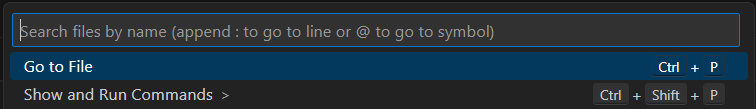
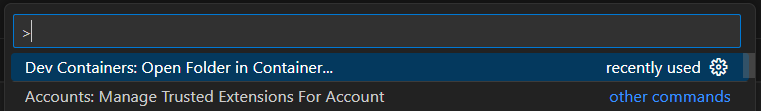
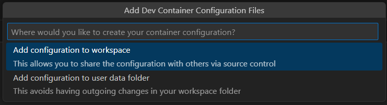
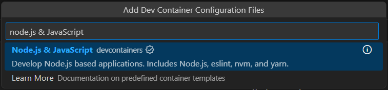
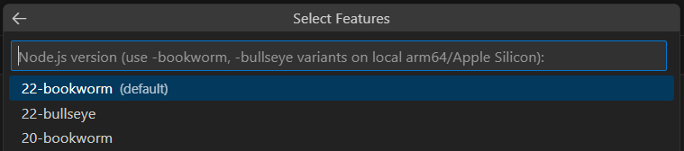
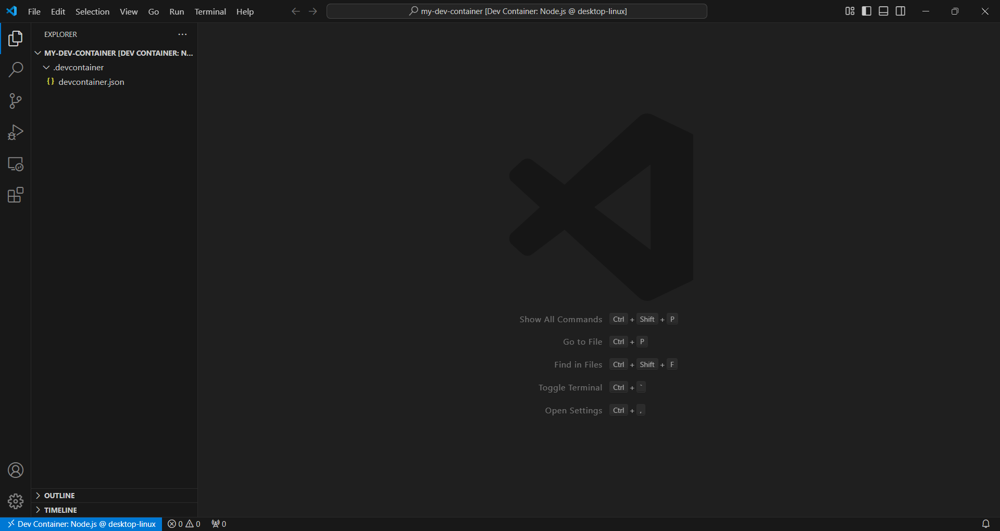

# 1-5 Create Docker Containers

A **Dev Container** is a Docker container set up to provide a ready-to-use development environment, often used with GitHub Codespaces. The setup is stored in a `.devcontainer` folder and can be customized for a project, branch, or team needs. It includes all the necessary tools and software, saving time on setup and ensuring everyone works in the same environment. The setup can also be modified, rebuilt, and shared across projects for consistency.

---

> ### Requirements
> Before proceeding, ensure you have the following installed on your system:
> - [Visual Studio Code](https://code.visualstudio.com/Download) (VS Code)
> - Remote Explorer  Extension (in VS Code)
> - Dev Container Extension (in VS Code)

---

## Step 1: Create a Folder for Project
Restart the computer once to avoid the docker's permission issue in VS Code.

In VS Code, open the terminal or use command `` Ctrl+shift+` ``, then use the command below to create a folder named `my-dev-container`and navigate to the directory.

```bash
mkdir my-dev-container
cd my-dev-container
```

## Step 2: Open Folder in Container
Hit `Ctrl + Shift + P` to open up Command Palette above, select **Show and Run Commands >** > **Dev Containers: Open Folder in Container...**, choose the folder created.





You will be prompted to select a folder to open the container. Select the folder you have just created: `my-dev-container`.

## Step 3: Configure Docker Container
Select **Add configuration to workspace** > **Node.js & JavaScript** > **20-bookworm** and click **OK**.









Congratulations! you have successfully created a Dev Container. Now, you can start developing inside this isolated environment with all the neccessary tools and dependencies.