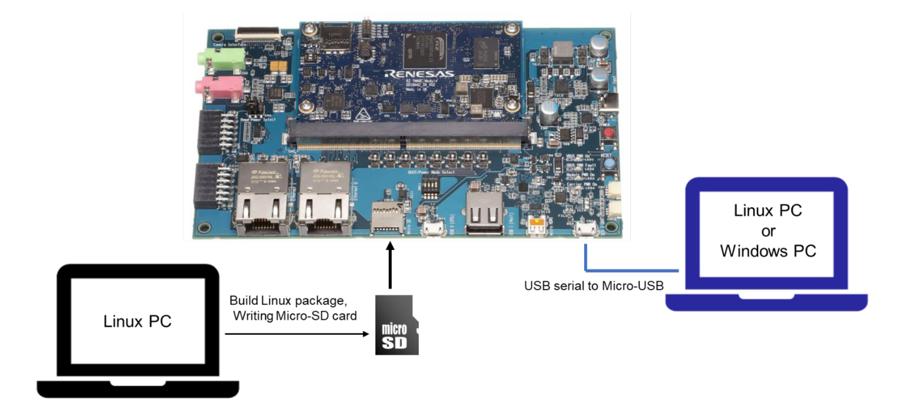
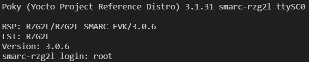
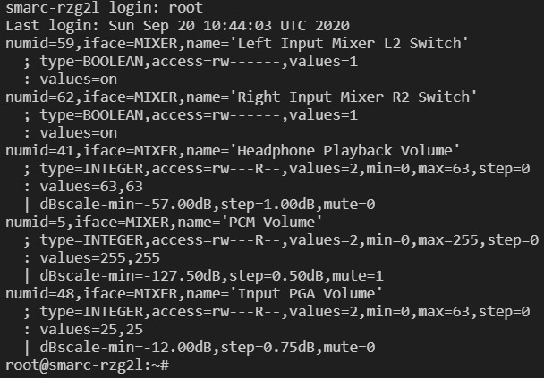

# 2-5 Boot Up RZ/G2L with SD card

Once you’ve set up the Weston or Qt GUI, it’s time to test the display on a computer. In this tutorial, you’ll learn how to boot up the RZ/G2L using images from an SD card.

---

## Step 1: Write Image to SD Card
Exit the Docker container, insert SD card to the PC

```bash
exit
```

Go to `home/rzg2l/yocto/build/tmp/deploy/images/smarcrzg/`directory , the enter the commands below,

```bash title:"check device ID of SD card"
sudo fdisk -l
```

```bash title:"unmount sda1 and sda2 if busy"
umount /dev/sda1
umount /dev/sda2
```

```bash title:"install bmaptool"
sudo apt update && sudo apt upgrade -y # update package manager
sudo apt install bmap-tools # installing bmaptool
bmaptool --version # check if it is installed successfully
```

```bash title:"flash the image into SD card"
sudo bmaptool copy core-image-qt-smarc-rzg2l.wic.gz /dev/sda
```

## Step 2: Boot up RZ/G2L
Remove SD card, insert it to RZ/G2L, connect the power input and serial monitor to your personal PC as shown below.



Open up the serial monitor in VS Code (ensure you have the Serial Monitor Extension installed first), select the port that is connected to the board, ensure you have toggled Terminal Mode and click on **"Start Monitoring"**.

Reboot by pressing on the blue button on the board. You will start seeing start-up messages on the serial monitor. Once the start-up is complete, you will be prompted for a login. Simply enter `root` to login.





Congratulations! You have successfully booted up the RZ/G2L board. On the next tutorial, we will learn how to add programs to the build and execute the program from the board.

---

## References
- [Linux Start-up Guide](./docs/Linux%20Start-up%20Guide%20(RZG2L,LC,UL).pdf)

---