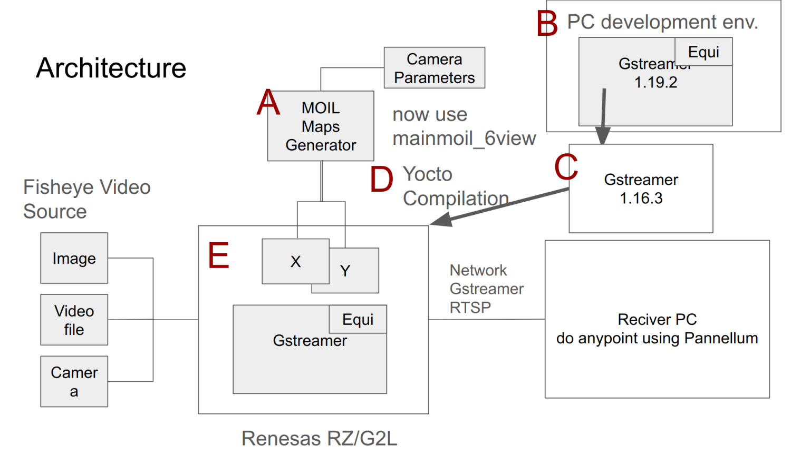

# 3-1 Introduction to GStreamer

**GStreamer** is a highly powerful and versatile framework for creating streaming media applications. We have a developed MOIL Equirectangular GStreamer plugin and aim to extend its applications to more use cases.

This chapter introduces the MOIL fisheye image processing technology implemented on the Renesas RZ/G2L hardware platform.

---

## Architecture

Given the limited development and runtime performance of embedded systems, we initially develop and test the software on a PC. Later, we will deploy it to the target hardware through cross-platform compilation.

Our goal is to implement MOIL image processing technology on the Renesas RZ/G2L, enabling image streaming over a network and fostering further system development on PCs or other hardware platforms.

The architecture is as follows:

## Development Process

The development process is outlined step-by-step below:

1. Generating the remap mapping files
2. Setting up the development environment using the `gst-plugins-bad-dev` project for GStreamer
3. Preparing the Renesas version of the `gst-plugins-bad` project and integrating the MOIL source code
4. Compiling the Yocto project on a PC and writing the bootable image to an SD card
5. Booting the Renesas RZ/G2L with the Yocto image and testing it on the target board

Knowledge of C and C++ will be extremely useful as we will be using them frequently during the development process.

---

## References

- [C Introduction](https://www.w3schools.com/c/c_intro.php)

- [C++ Introduction](https://www.w3schools.com/cpp/cpp_intro.asp)

---