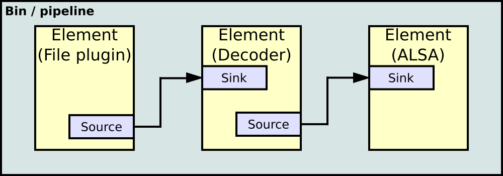

# 3-3 Developing GStreamer Plugins

**GStreamer plugins** are modular components that extend the functionality of the GStreamer multimedia framework by providing specific capabilities like data sources, filters, encoders, decoders, and sinks. Each plugin contains one or more elements that perform a particular task, such as reading from a file, decoding video, applying effects, or streaming media over a network. 

Plugins are categorized into groups like *base, good, bad,* and *ugly* based on their quality, licensing, and stability. They allow developers to create complex media pipelines by combining elements dynamically, making GStreamer highly flexible and extensible for diverse multimedia applications.

The image below shows how GStreamer elements are linked as a pipeline.



---

## Step 1: Installing GStreamer

To install GStreamer on Ubuntu 22.04, use the following command:

```bash
sudo apt install libgstreamer1.0-dev libgstreamer-plugins-base1.0-dev libgstreamer-plugins-bad1.0-dev gstreamer1.0-plugins-base gstreamer1.0-plugins-good gstreamer1.0-plugins-bad gstreamer1.0-plugins-ugly gstreamer1.0-libav gstreamer1.0-tools gstreamer1.0-x gstreamer1.0-alsa gstreamer1.0-gl gstreamer1.0-gtk3 gstreamer1.0-qt5 gstreamer1.0-pulseaudio
```

## Step 2: Try 'Hello World' Program

Try out this Hello World tutorial below by creating a program named 'basic-tutorial-1.c`.

```c title="basic-tutorial-1.c"
#include <gst/gst.h>

#ifdef __APPLE__
#include <TargetConditionals.h>
#endif

int
tutorial_main (int argc, char *argv[])
{
  GstElement *pipeline;
  GstBus *bus;
  GstMessage *msg;

  /* Initialize GStreamer */
  gst_init (&argc, &argv);

  /* Build the pipeline */
  pipeline =
      gst_parse_launch
      ("playbin uri=https://gstreamer.freedesktop.org/data/media/sintel_trailer-480p.webm",
      NULL);

  /* Start playing */
  gst_element_set_state (pipeline, GST_STATE_PLAYING);

  /* Wait until error or EOS */
  bus = gst_element_get_bus (pipeline);
  msg =
      gst_bus_timed_pop_filtered (bus, GST_CLOCK_TIME_NONE,
      GST_MESSAGE_ERROR | GST_MESSAGE_EOS);

  /* See next tutorial for proper error message handling/parsing */
  if (GST_MESSAGE_TYPE (msg) == GST_MESSAGE_ERROR) {
    g_printerr ("An error occurred! Re-run with the GST_DEBUG=*:WARN "
        "environment variable set for more details.\n");
  }

  /* Free resources */
  gst_message_unref (msg);
  gst_object_unref (bus);
  gst_element_set_state (pipeline, GST_STATE_NULL);
  gst_object_unref (pipeline);
  return 0;
}

int
main (int argc, char *argv[])
{
#if defined(__APPLE__) && TARGET_OS_MAC && !TARGET_OS_IPHONE
  return gst_macos_main ((GstMainFunc) tutorial_main, argc, argv, NULL);
#else
  return tutorial_main (argc, argv);
#endif
}
```

Compile it by using the command below:

```bash
gcc basic-tutorial-1.c -o basic-tutorial-1 `pkg-config --cflags --libs gstreamer-1.0`
```

If everything is built correctly, you may run the executable. You should see a window pop up, containing a video being played straight from the Internet, along with audio.


<div>
  <video width="100%" height="100%" playsinline autoplay muted controls>
    <source src="video/stream_test.mp4" type="video/mp4" />
  </video>
</div>

:::tip[Feel free to play around by adding more parameters and observe the output!]

Examples:
```bash
gst-inspect-1.0 geometrictransform
```
```bash
gst-inspect-1.0 circle
```
The commands above will show information such as the source module, plugin and element.

```bash
gst-launch-1.0 videotestsrc pattern=0 ! autovideosink
```

Different patterns can be generated by adjusting the `pattern` parameter from 0 to 25.

```bash
gst-launch-1.0 videotestsrc ! video/x-raw, width=1920, height=1080 ! videoconvert ! circle ! videoconvert ! autovideosink 
```

:::