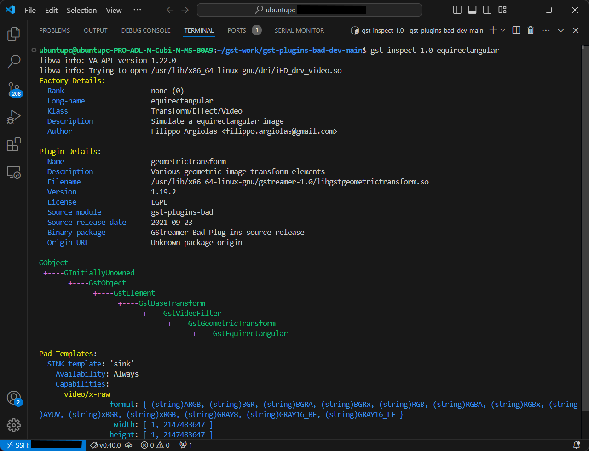

# 3-4 Try a Gstreamer Project

The **gst-plugins-bad project** is a collection of GStreamer plugins that offer experimental or less commonly used features. These plugins are not as stable or reliable as the "good" plugins, but they can still be useful for certain tasks. The project has been merged into the main GStreamer repository for ongoing development.

This tutorial will show you how to setup the environment of **gst-plugins-bad-dev** project.

## Step 1: Set Up Development Environment Using `gst-plugins-bad-dev`

The `gst-plugins-bad-dev` package is part of the GStreamer multimedia framework and provides the development files needed for working with the "bad" set of plugins in GStreamer.

:::info[What are GStreamer plugins?]

GStreamer plugins are modular components that extend the functionality of GStreamer by providing support for various codecs, formats, protocols, and other multimedia capabilities. These plugins are grouped into four categories based on their stability and quality:

1. `Base`: Stable, well-maintained, and widely used plugins.
2. `Good`: Good-quality plugins that are reliable and free from licensing issues.
3. `Bad`: Experimental plugins that are under development or have known issues (may require more testing or refinement).
4. `Ugly`: High-quality plugins with licensing or patent concerns.

:::

Download the modified project here by cloning the GitHub repo below:

```bash
git clone https://github.com/yourskc/gst-plugins-bad-dev
```

which is developed based on the [original project](https://github.com/GStreamer/gst-plugins-bad).

This modified project includes a new element named `equirectangular` as part of the gst-plugins-bad geometric transform plugin. It contains GStreamer code units, build instructions, and test commands.

## Step 2: Installing Meson

Install the Meson build system:

```bash
sudo apt-get install python3 python3-pip python3-setuptools python3-wheel ninja-build
```

Go to the `gst-plugins-bad-dev` directory and start the build:

```bash
meson build
ninja -C build
```

:::tip
If `meson` is not installed, use the command below to install it.

```bash
sudo apt install meson
```
:::

Verify the build by checking the creation of the file `libgstgeometrictransform.so` in the directory `gst-plugins-bad-dev/build/gst/geometrictransform`.

Install the library and inspect:

```bash
sudo cp ./build/gst/geometrictransform/libgstgeometrictransform.so /usr/lib/x86_64-linux-gnu/gstreamer-1.0
```
```bash
gst-inspect-1.0 equirectangular
```

The expected output should be:

