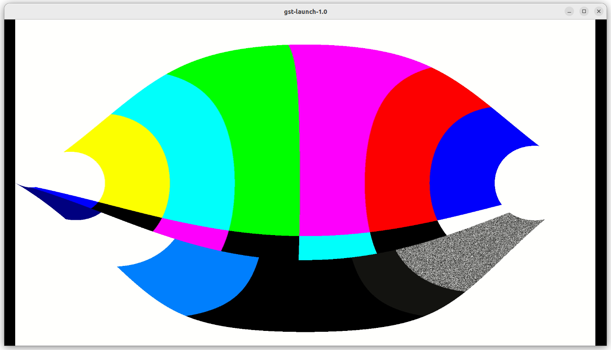

# 3-6 Performing Stream Tests on RZ/G2L

In this tutorial, we will perform streaming tests on RZ/G2L with hardware-specific encoder/decoder adjustments. Then we will try to stream videos from RZ/G2L to PC using GStreamer commands.

---

## 1. Send test_env to RZ/G2L
From mini PC, use the scp command to send the directory to RZ/G2L board:

```bash
cd gst-plugins-bad-dev
```

```bash
scp -oHostKeyAlgorithms=+ssh-rsa -r test_env root@192.168.2.XXX:/home/root
```

## 2. Basic Test

Boot up RZ/G2L board, login the RZ/G2L board by entering the password `root` or `su -`


Run the following command to check for basic video source test

```bash
gst-launch-1.0 videotestsrc ! autovideosink
```

Next, enter test_env directory

```bash
cd test_env
```

Then, ensure the equirectangular filter is working properly by running

```bash
gst-launch-1.0 videotestsrc ! video/x-raw,width=1920,height=1080 ! videoconvert ! equirectangular ! videoconvert ! autovideosink
```

The output should look like below:



## 3. Streaming Test

Now, we will stream from RZ/G2L to mini PC. On the terminal of Ubuntu 22.04, run the following command to wait for h.264 stream from RZ/G2L:

```bash
gst-launch-1.0 udpsrc port=5000 ! application/x-rtp,media=video,clock-rate=90000,encoding-name=H264,payload=96 ! rtph264depay ! avdec_h264 ! autovideosink
```

Run the 3 scripts below in RZ/G2L, each with different sets of plugins:

```bash title="run1.sh"
gst-launch-1.0 -e filesrc location=./endo01.mp4 ! qtdemux ! queue ! h264parse ! video/x-h264, stream-format=avc,alignment=au ! rtph264pay pt=96 name=pay0 config-interval=3 mtu=6000 ! udpsink host=your-ip-address port=5000
```

```bash title="run2.sh"
gst-launch-1.0 -e filesrc location=./endo01.mp4 ! qtdemux ! queue ! h264parse ! omxh264dec ! omxh264enc ! rtph264pay config-interval=10 ! udpsink host=your-ip-address port=5000
```

```bash title="run3.sh"
gst-launch1.0 -e filesrc location=./endo01.mp4 ! h264parse ! omxh264dec ! videoconvert ! equirectangular ! videoconvert ! omxh264enc ! rtph264pay config-interval=10 ! udpsink host=your-ip-address port=5000
```

Note how different plugins may have an impact to the performance of the video streaming(eg. latency, frame rates, resolution).

:::warning

Remember to change the IP address to the assigned IP on your RZ/G2L board!

:::

## 4. Local Streaming Test

```bash title="run4.sh"
gst-launch-1.0 -e filesrc location=./endo01.mp4 ! qtdemux ! queue ! h264parse ! omxh264dec ! videoconvert ! equirectangular ! videoconvert ! autovideosink
```

## 5. Stream with usb camera
Connect a USB camera to RZ/G2L and replace the source in the command as shown below:

```bash
cd test_env
```

```bash
gst-launch-1.0 v4l2src device=/dev/video0 ! videoscale ! video/x-raw, width=1920, height=1080 ! videoconvert ! autovideosink
```

```bash
gst-launch-1.0 v4l2src device=/dev/video0 ! videoscale ! video/x-raw, width=1920, height=1080 ! videoconvert ! equirectangular ! videoconvert ! autovideosink
```

:::tip

Since the execution speed is slow, some frames could be dropped during the playback. A longer mp4 test file is recommended as it would be better for demonstration purposes.

:::

---