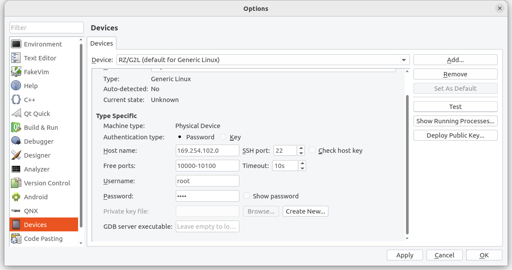
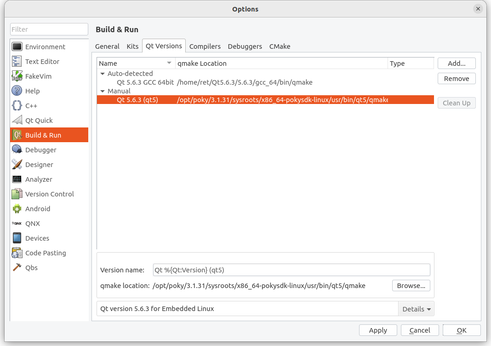
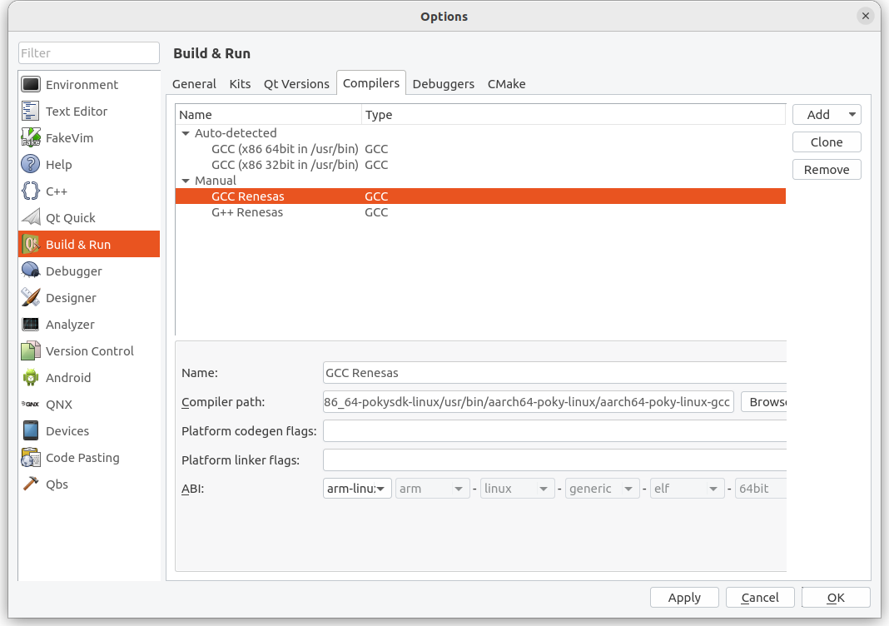
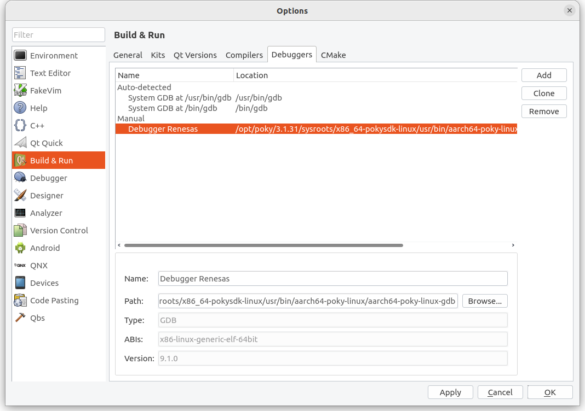
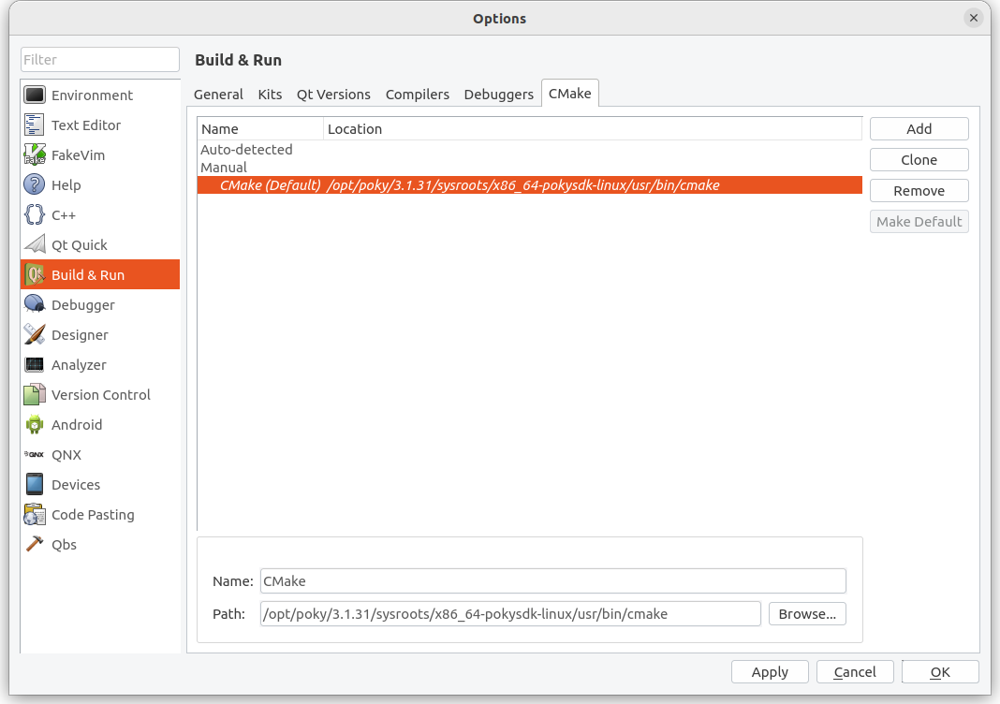
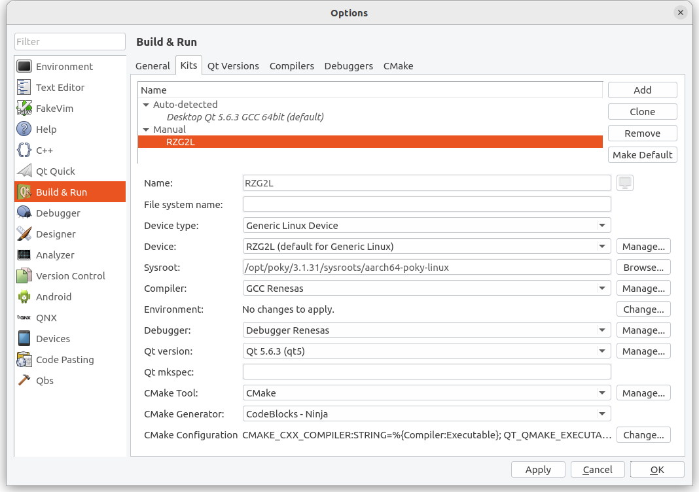

# 4-3 Installation of Qt Creator

In this tutorial, we will learn how to install Qt 5.6.3 on Ubuntu and configure an RZ/G2L Build & Run Kit on Qt Creator.

---

## Step 1: Install Qt Versions

Install **Qt 5.6.3** as the primary version for Ubuntu 22.04.

**Qt 5.12.10** is optional but provides useful examples.

<details>
  <summary>Downloads</summary>

- [Qt5.6.3 Download](https://download.qt.io/new_archive/qt/5.6/5.6.3/)
- [Qt5.12.10 Download](https://download.qt.io/archive/qt/5.12/5.12.10/)

</details>

:::tip[Switching Between Qt Versions]

Switching between versions may cause errors due to shared settings.

Backup settings for each version to avoid conflicts.

Settings location:
- **Linux**: `~/.config/QtProject`
- **Windows**: `%appdata%/QtProject`

:::

## Step 2: Set Environment Variables ★

Before launching Qt Creator, set the following environment variables:

```bash
unset LD_LIBRARY_PATH
source /opt/poky/3.1.31/environment-setup-aarch64-poky-linux
```

## Step 3: Run Qt Creator ★

Navigate to the Qt Creator directory and launch the application:

```bash
cd ~/Qt5.6.3/Tools/QtCreator/bin/
./qtcreator
```

## Step 4: Connect to RZ/G2L

In Qt Creator, navigate to `Tools > External > Configure`
.
Under Devices, input the IP address of the RZ/G2L target board and click Test to verify the connection.



## Step 5: Qt Kits Settings
1. Qt Version  
`/opt/poky/3.1.31/sysroots/x86_64-pokysdk-linux/usr/bin/qt5/qmake`



2. Compilers  
C Compiler :   
`/opt/poky/3.1.31/sysroots/x86_64-pokysdk-linux/usr/bin/aarch64-poky-linux/aarch64-poky-linux-gcc`  
C++ Compiler :  
`/opt/poky/3.1.31/sysroots/x86_64-pokysdk-linux/usr/bin/aarch64-poky-linux/aarch64-poky-linux-g++`



3. Debugger  
`/opt/poky/3.1.31/sysroots/x86_64-pokysdk-linux/usr/bin/aarch64-poky-linux/aarch64-poky-linux-gdb`



4. Cmake  
`/opt/poky/3.1.31/sysroots/x86_64-pokysdk-linux/usr/bin/cmake`



## Step 6: Kits Setting
Click on `Build & Run` on the left, Choose `Kits`, Then `Add`, Set **Name** as "RZ/G2L", Set Qt Version, Compiler, Debugger, Cmake, alternatively you can click on the 'Manager' on the right side, add and set the paths, or Choose from the Tabs on the upper items(Qt Version/ Compiler/ Debuggers ). Set all of the settings.



After the settings, please make sure there are no exclamation on the Kits icon, or you need to check if there are some errors need to be fixed.