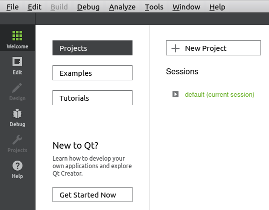
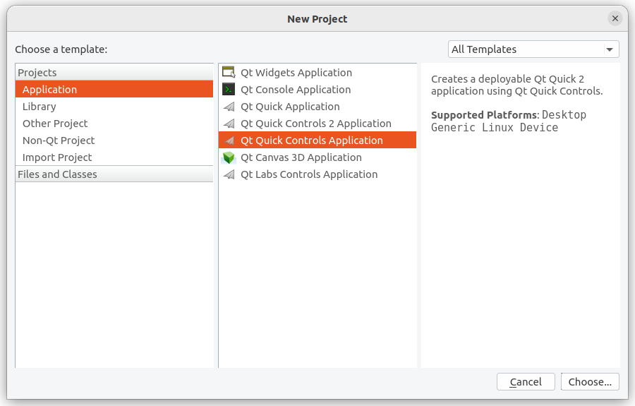
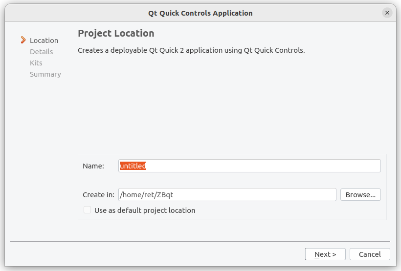
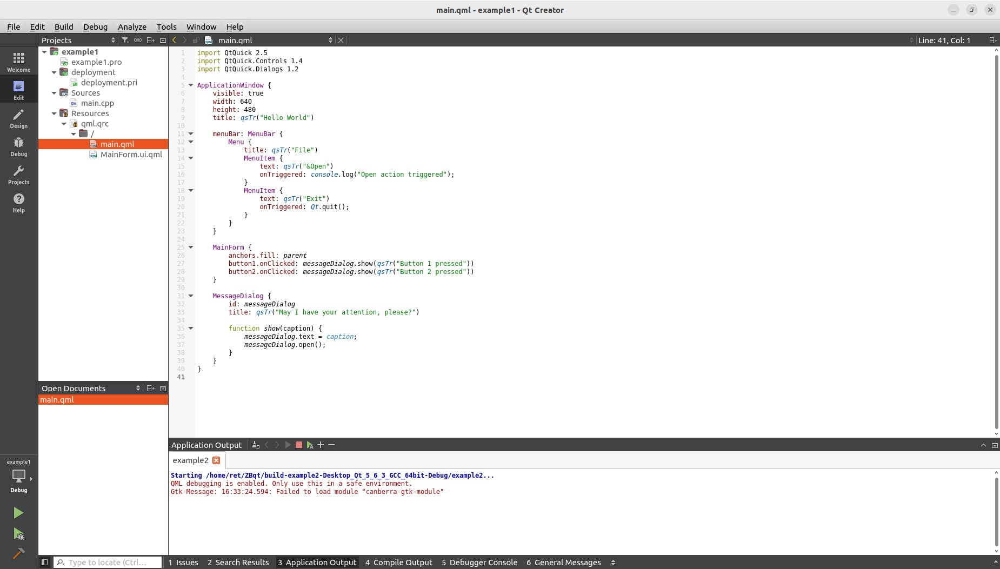
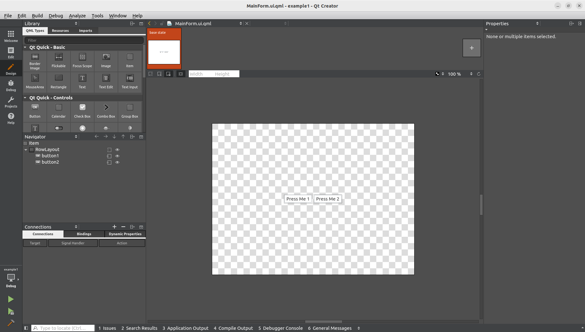
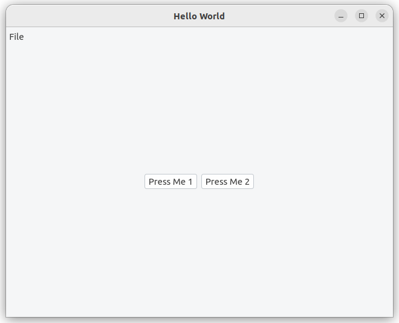
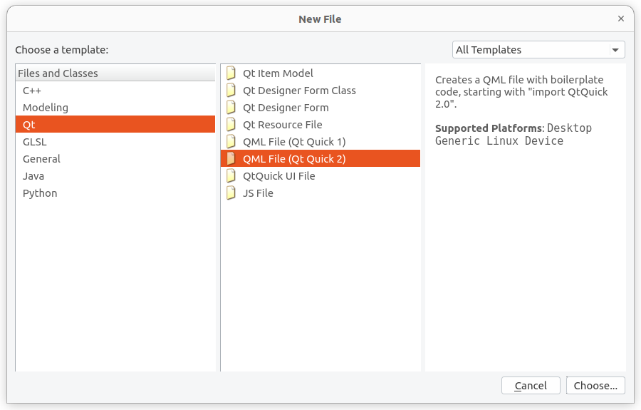
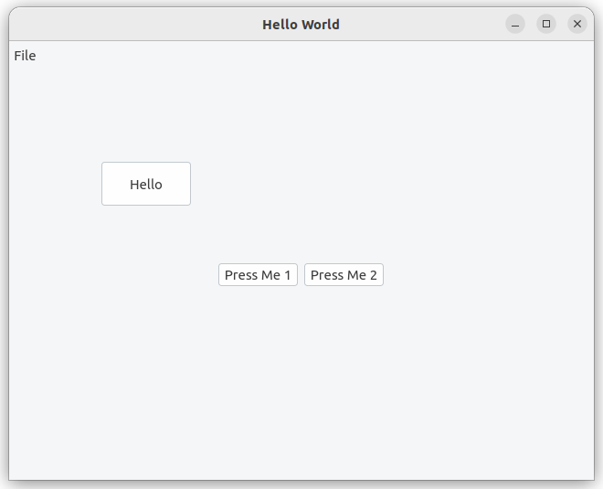

# 4-4 Building Qt Project on Ubuntu

In this tutorial, we will build a Qt Project. Lets start by opening an existing example project or creating a blank project in Qt Creator.

---

## Step 1: Open Qt Creator

Open Qt Creator by using this command

```bash title="Open a terminal window, input the commands,"
unset LD_LIBRARY_PATH
source /opt/poky/3.1.31/environment-setup-aarch64-poky-linux
```

```bash title="Run Qtcreator ( Qt5.6.3 )"
cd ~/Qt5.6.3/Tools/QtCreator/bin/
./qtcreator
```

## Step 2: Create New Project

1. Click on the `Welcome` on the left top, then click `New Project`



2. Choose `Application/Qt Quick Controls Application`



3. Input the **name** and **location** of your project and proceed `Next` until the end.



You have successfully create a new project.



## Step 3: Build Default Control Application

1. Click `Design`, Qt will switch to Design mode immediately. Under Design mode, we can drag the objects like buttons, or drag the contols from the left side to the center canvas. You also can click on anyone of the control list, then set it's properties on the right-hand side. 



2. You can click the 'Edit' to switch the window back to Edit mode to see all of the changes. Then, click the `Run` button to build the project.



## Step 4: Add a 'Hello' Button

1. Right Click `/` under `Resources/qml.qrc`, add new qml file named 'Btn'.



2. Modify the code of Btn.qml to

```bash 
import QtQuick 2.5
import QtQuick.Controls 1.4
import QtQuick.Layouts 1.2
        Button {
            width: 100
            height: 50
            id: button1
            text: qsTr("Hello")
            }
```

3. Add the code to `ApplicationWindow { }` in main.qml

```bash 
Btn {
    x:100
    y:100
}
```

4. Click on `Run` button in the lower left corner, the 'Hello' Button is created.




:::info

**QML (Qt Markup Language):** Used to design graphical user interfaces. Supports touch and mobile-focused development.

**Qt Quick:** A library of QML classes and functions for UI design.

**Qt Quick Controls:** Provides visual components like buttons, sliders, and text boxes.

:::

:::tip

Be cautious about version differences. This guide uses Qt 5.6.3, so ensure compatibility when searching for resources online.

Start with the provided Qt examples to familiarize yourself with UI programming basics.

:::

---