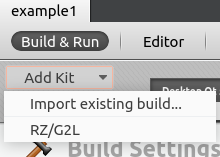
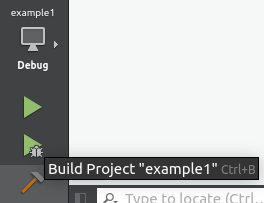

# 4-5 Building Executables for RZ/G2L

Now, we will try to deploy a version of our application to the Renesas RZ/G2L target board after testing on a PC.

---

## Step 1: Set Up Kits In Qt Creator

Open Qt Creator and click on `Projects` in the left menu.

Add the RZ/G2L kit by selecting `Add Kits` > `RZ/G2L`.



## Step 2: Build and Transfer the Executable

Click the Build button located at the lower-left corner.



The compiled executable will be located in:

`build-ex01-RZG2L-Debug/ex01`

Use the scp command to send the file to RZ/G2L board:

```bash
scp ex01 root@rz-ip-address:/home/root
```

:::tip

The Linux image built with the `core-image-qt` parameter includes SSH and SCP functionality. If SSH fails due to newer PC client restrictions on the `ssh-rsa` algorithm, resolve the issue by adding the following parameter to your SSH command:

```bash
ssh -v -oHostKeyAlgorithms=+ssh-rsa root@<RZ/G2L_IP>
```

Alternatively, edit the SSH configuration file:

```bash
vim ~/.ssh/config
```

And add the following:

```
Host *
  ServerAliveInterval 10
  HostKeyAlgorithms +ssh-rsa
  PubkeyAcceptedKeyTypes +ssh-rsa
```

:::

## Step 3: Run the Executable

Run the executable using the command below:

```bash
./ex01
```

## Step 4: Coffee Machine Example

The official Qt Coffee Machine Example (Qt 5.15 LTS) is available [here](https://doc.qt.io/qt-5/qtdoc-demos-coffee-example.html), but it cannot be compiled in the current environment.

Please use a modified version that is compatible with Qt 5.6.3 and is tested on RZ/G2L:

```bash
git clone https://github.com/yourskc/moil_coffee.git
```

Follow the steps from above to compile the Coffee Machine project in Ubuntu 22.04.

Transfer and execute the compiled project on RZ/G2L using the same process.

The project can be controlled via a mouse or a touchscreen, making it functional for mobile or smart device interfaces.

:::tip

- Practice QML and Qt Quick programming using this example.
- Study the asset usage in the project for inspiration and guidance in creating your own UI designs.

:::

---

## References

- **[Qt Quick Control](https://doc.qt.io/qt-5/qtquickcontrols-index.html)**: Learn about available UI components like buttons and sliders.
- **[Qt Quick Designer](https://doc.qt.io/qtcreator/creator-qtquickdesigner-plugin.html)**: Use the visual interface for designing and prototyping QML applications.

---