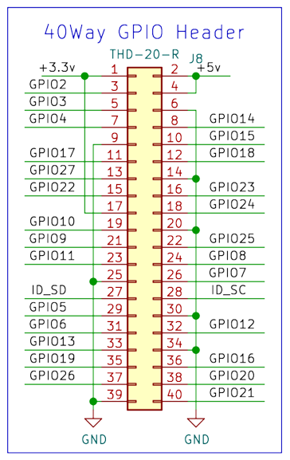

## Step 1: add MIPI camera drivers
```bash
sudo nano /boot/firmware/config.txt
```

add below #Automatically load overlays
- \# camera_auto_detect=1
- dtoverlay=ov5647,cam0/1
- dtoverlay=imx708,cam0/1

## Step 2: enable cam1
- fit two jumpers at J6

## Step 3: open the camera using
```bash title="run 5s"
- rpicam-hello 
```

```bash title="always run"
- rpicam-hello -t0 
```

```bash title="select which camera to run, can run both together in different terminals"
- rpicam-hello --camera 0/1 
```

## GPIO reference
