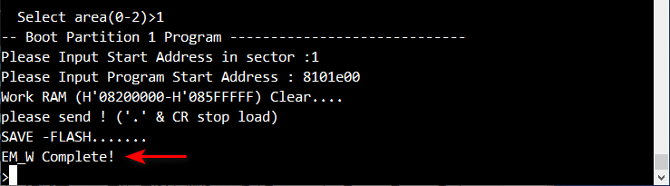

### Requirements
- Download TeraTerm software [here](https://tera-term.en.softonic.com/?ex=RAMP-3582.4&rex=true) 
- Download the pre-built images of MYZR-RZV2H-EK320 
- Copy all the pre-built images files to a USB drive

## Step 1: Connect the Development Board

- Toggle the power switch (SW3) to the ***OFF*** position.

- Set the DIP switch (SW2) to `flashing mode`, toggle switch 1 to ***OFF*** and switch 2 to ***ON***.

- Connect a USB Type-C data cable from socket (CON2) of the development board to a computer. 

- Connect a 12~24V power supply to the power interface (P3) of the development board.

## Step 2: Flash the Boot

### a) Erase memory on eMMC 

- Open TeraTerm, create a new connection with Serial port. For example, USB-SERIAL CH340 (COM8).


- Go to `Setup -> Serial port` in the menu bar, select 115200 baud rate and save.


- Toggle the power switch to ***ON*** to power on the development board, you shall see:

```bash
     SCI Download mode (Normal SCI boot)
     -- Load Program to SRAM ---------------
```

- Drag the Flash_Writer_SCIF_MYZR_RZV2H_INTERNAL_MEMORY.mot file directly into the window.


- Wait for the Flash tool transmission to complete, you can see the transmission progress:


### b) Initiate the boot process

- After the flash tool transmission is completed, enter `sup` in terminal.


- Go to `Setup -> Serial port` in the menu bar and change the serial port baud rate to 921600.


**bl2 (Boot Loader 2)**

- Enter the following content in the terminal:

```bash     
     em_w
     1
     1
     8101e00
```


- Drag the bl2_bp_emmc-myzr-rzv2h-bb320-revb-8g.srec file directly into the window and wait for the transmission to complete.

 

### c) Executing firmware components

**flp (Firmware Image Package)**

- Enter the following content in the terminal:

```bash     
     em_w
     1
     300
     44000000
```


- Drag the fip-myzr-rzv2h-bb320-revb-8g.srec file directly into the window and wait for the transmission to complete.

 

- The Boot flashing is completed. Toggle the power switch to ***OFF*** and close the Tera Term.

## Step 3: Start the BOOT

- Insert the previously prepared USB drive into the USB port of the development board.

- Set the DIP switch to `boot mode`, toggle switch 1 to ***ON*** and switch 2 to ***ON***.

- Open TeraTerm, select the configuration same as previous (serial port, baud rate 115200).

- Toggle the power switch to ***ON*** to power on the development board.

- When you see the countdown appear, press `Enter` key to enter U-BOOT.

```bash    
     NOTICE:  BL2: v2.7(release):3ff5203
     NOTICE:  BL2: Built : 12:10:31, May 24 2025
     NOTICE:  BL2: Booting BL31
     NOTICE:  BL31: v2.7(release):3ff5203
     NOTICE:  BL31: Built : 12:10:31, May 24 2025
     
     
     U-Boot 2021.10 (May 26 2025 - 08:03:39 +0000)
     
     CPU:   Renesas Electronics CPU rev 1.0
     Model: MYZR RZV2H LGA320 Evaluation Kit - 8GB Memory
     DRAM:  7.9 GiB
     MMC:   mmc@15c00000: 0, mmc@15c10000: 1
     Loading Environment from MMC... *** Warning - bad CRC, using default environment
     
     In:    serial@11c01400
     Out:   serial@11c01400
     Err:   serial@11c01400
     Net:   eth0: ethernet@15c30000
     Hit any key to stop autoboot:  0
     =>
```

- Clear the old environment variables to avoid unnecessary errors.

```bash
     env default -a; saveenv
```

- Restart the development board by pressing `Reset` button.

- Start the flashing images from the USB drive.

```bash
     run bootcmd_usb
```
     
- Wait for the flashing to complete, the process could take a long time.

:::info[ignore the error message below]

the message won't affect the outcomes

```bash
[ 87.253660] renesas_sdhi_internal_dmac 15c00000.mmc: swiotlb buffer is full (sz: 131072 bytes), total 32768 (slots), used 28676 (slots)
```

:::

- After the flashing is completed, press `Reset` button to restart the development board. 

```bash  
     Poky (Yocto Project Reference Distro) 3.1.31 myzr-rzv2h-ek320 ttySC0
     
     BOARD: MYZR RZV2H LGA320 Evaluation Kit
     LSI: RZ/V2H
     AI SDK V5.00 (Source Code)
     myzr-rzv2h-ek320 login:
```

- Enter root to log in.

```bash
     root
```

